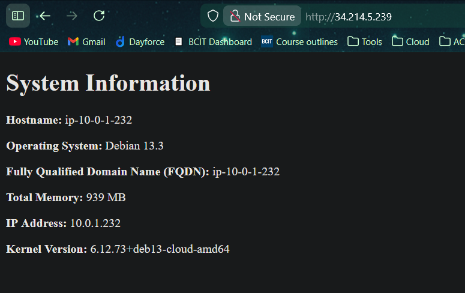

# acit4640-lab7

## Team

- Angad Bains

## create new keys

```bash
ssh-keygen -t ed25519 -f ~/.ssh/aws
```

This command will create the ssh key in the .ssh directory of the user. It will create a `aws` private key and a `aws.pub` public key.

## run included scripts to import and delete keys

```bash
./scripts/import_lab_key /home/anges/.ssh/aws.pub
```

This will add the newly created key to our logged in aws account.

```bash
./scripts/delete_lab_key
```

This removes the key from our aws account, as it is no longer needed.

## terraform commands

```bash
cd terraform/
terraform init
terraform apply
```

Using these commands we initialize terraform at the location where our terraform configuration (main.tf) is present. `Apply` allows us to create the ec2 instances as configured in our terraform file.

Output:

```bash
instance_ip_addr = {
    "dns_name" = "ec2-16-148-95-129.us-west-2.compute.amazonaws.com"
    "dns_name-2" = "ec2-34-214-5-239.us-west-2.compute.amazonaws.com"
    "public_ip" = "16.148.95.129"
    "public_ip-2" = "34.214.5.239"
}
```

We will update the `ansible/inventory/hosts.yml` file with this information.

```bash
terraform destroy
```

We use this once we are done with all our work so we can remove our aws resorces that are no longer needed.

## ansible commands

```bash
ansible-playbook --check playbook.yml
```

After completeing the laybook, run this to trouleshoot any issues with the current setup. It allows dry runs to verify the config.

```bash
ansible-playbook playbook.yml
```

Once satisfied, run the playbook with this command and it will execute the set configuration.

## rendered html page


